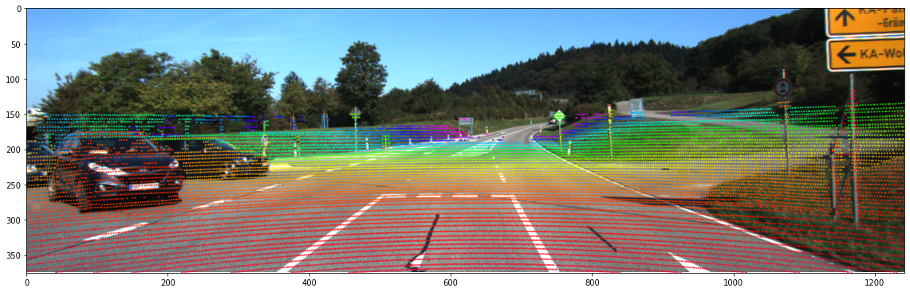
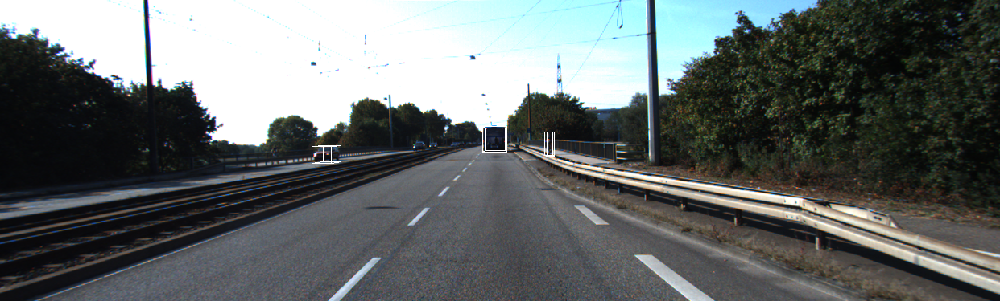
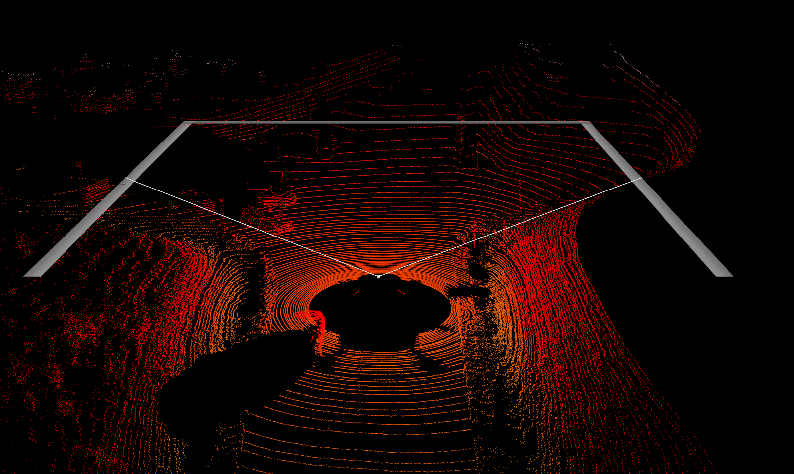

# 3D_obj_2017

## Introduction
KITTI dataset — LiDAR point cloud visualization | LiDAR to image projection | 3D BBox labelling on image


## Dependencies
Dependencies `numpy`, `matplotlib`, `cv2`, `mayavi` and 'PIL' need to be installed to run the program.
```
numpy == 1.19.5
matplotlib == 3.3.4
opencv-python = 4.6.0
mayavi = 4.7.3
Pillow = 8.4.0
```
## Dataset
[KITTI website](https://www.cvlibs.net/datasets/kitti/eval_object.php?obj_benchmark=3d)

## Project Structure
The file structure is as follows

```
3D_obj_2017/
├── data_object_image_2/
│   └── testing/
│   └── training/
│       └── image_2/
│           └── 000001.png
├── data_object_velodyne/
│   └── testing/
│   └── training/
│       └── velodyne/
│           └── 000001.bin
├── data_object_calib/
│   └── testing/
│   └── training/
│       └── calib/
│           └── 000001.txt
├── data_object_label_2/
│   └── training/
│       └── label_2/
│           └── 000001.txt
├── data_velo2cam/
│   └── testing/
│       └── 000001.png 
├── viz_velo2cam.py
├── viz_3DPC.py
├── viz_3DBB.py

```

| File                   | Description                                                                                      |
| ---------------------- | ------------------------------------------------------------------------------------------------ |
| `data_velo2cam.py`     | LiDAR point cloud to camera image projection and visualisation.                                  |
| `data_3DBB.py`         | 3D object annotation of the image.                                                               |
| `data_3DPC.py`         | LiDAR point cloud visualization                                                                  |

## Quick Demo
Run `data_velo2cam.py`


Run `data_3DBB.py`


Run `data_3DPC.py`

